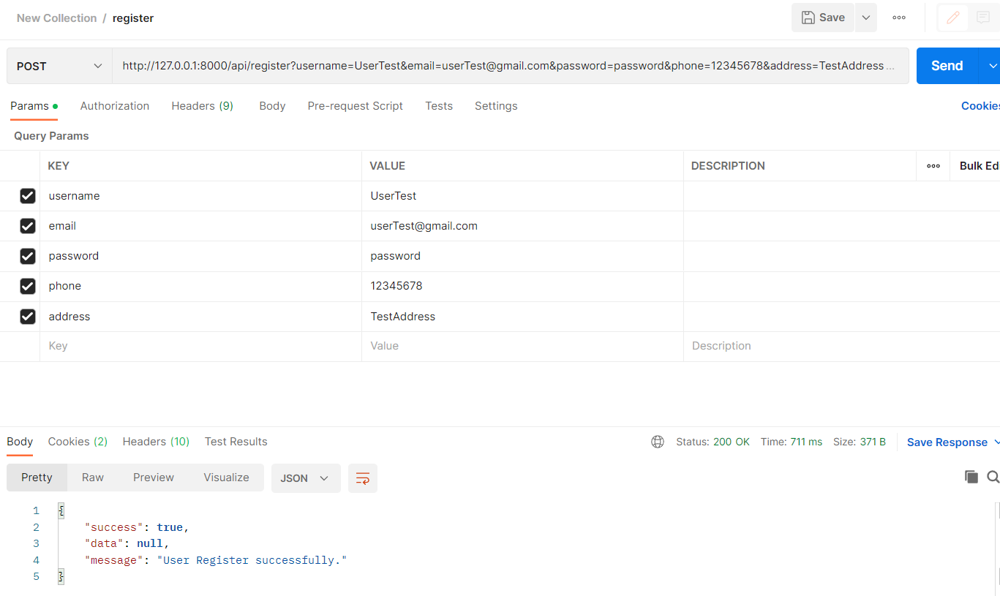
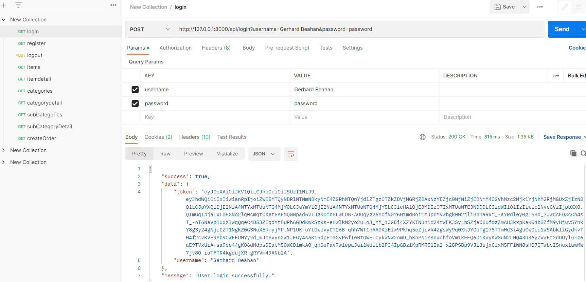
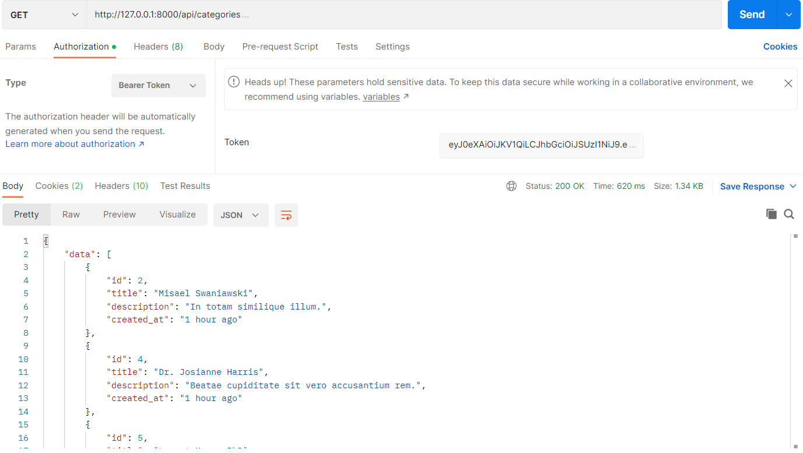
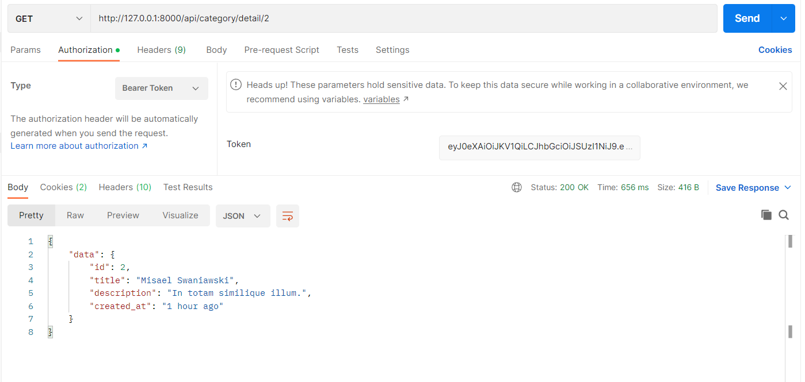
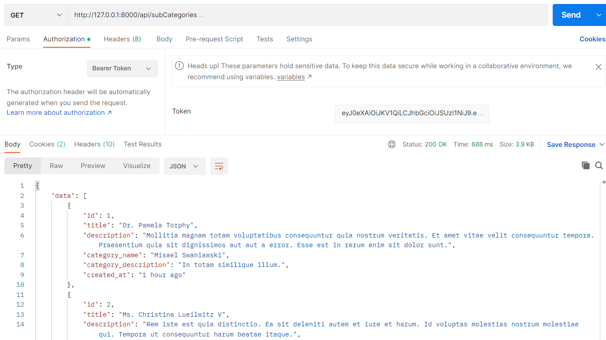
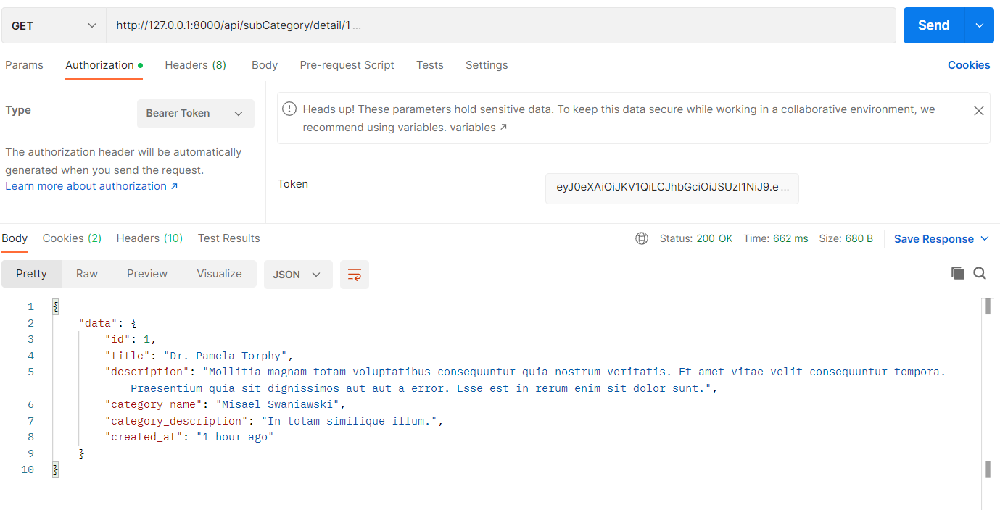
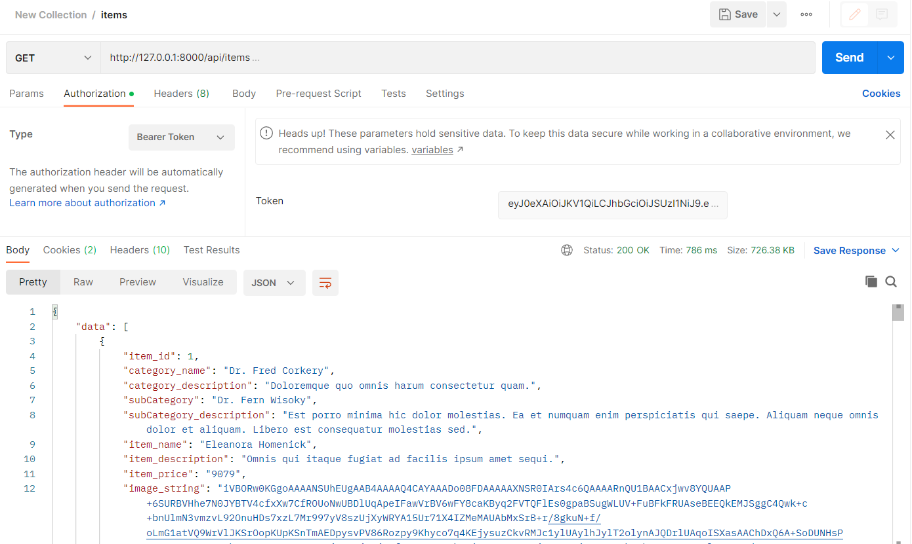
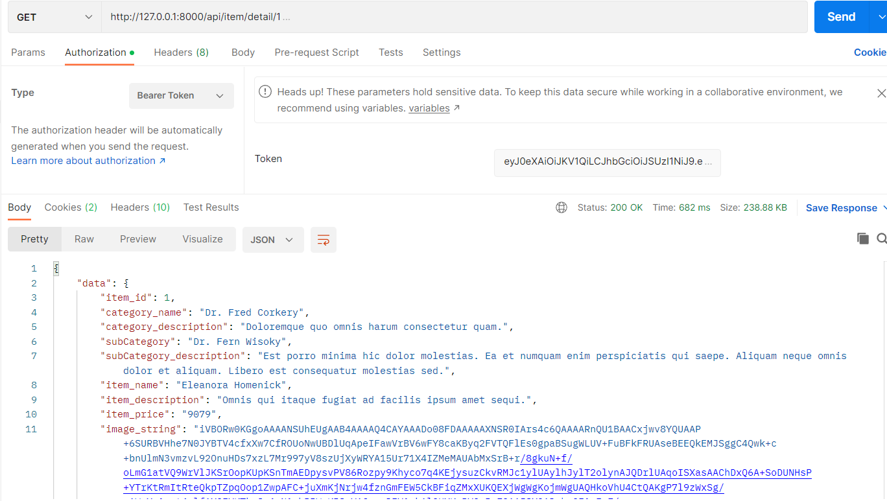

# Htet Htet Oo Wai

## Name
Ecommerce CRUD for Interview Task

## Setup Guide for Laravel without docker
```
git clone 
cd into cloned project folder
cd src
run composer install
copy of .env.example and rename it to .env
change DB section with your local MySQL database setting
create new database in your local MySQL
run php artisan migrate:fresh --seed
run php artisan key:generate
run php artisan passport:install
run php artisan storage:link
run php artisan optimize
run php artisan serve
```

## Setup Guide for Laravel with docker
```
cd into cloned project folder
run docker-compose build
run docker-compose up -d
run docker exec -it php_laravel sh
run composer install
copy of .env.example and rename it to .env
change DB like this
DB_CONNECTION=mysql
DB_HOST=mysql
DB_PORT=3306
DB_DATABASE=laravel
DB_USERNAME=MYSQL_ROOT_PASSWORD
DB_PASSWORD=root
run php artisan migrate:fresh --seed
run php artisan key:generate
run php artisan passport:install
run php artisan storage:link
run php artisan optimize
```
## Print Screen of Postman

















## Versions I have used
- PHP => ^8.0.2
- Laravel framework => ^9.19
- MySQL => 8.0
